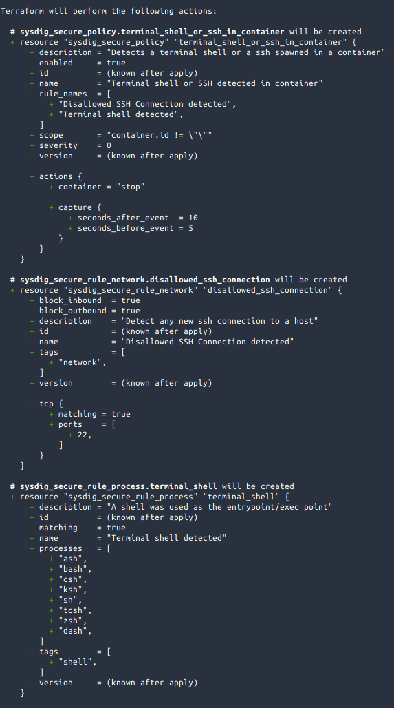
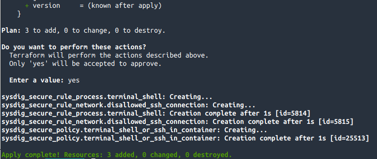
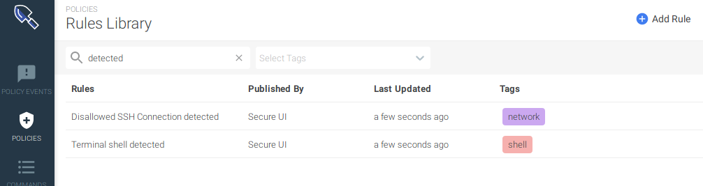
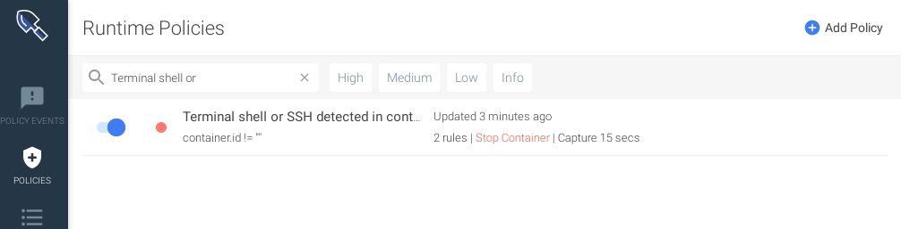
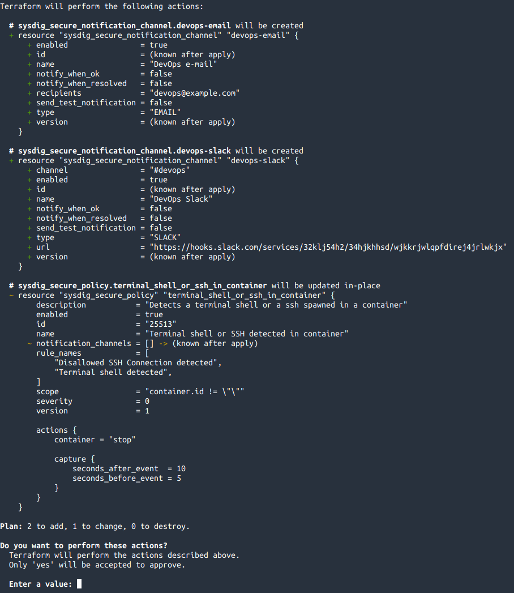
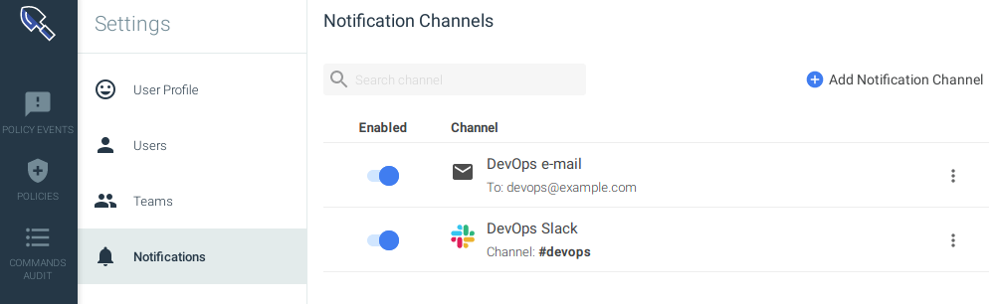
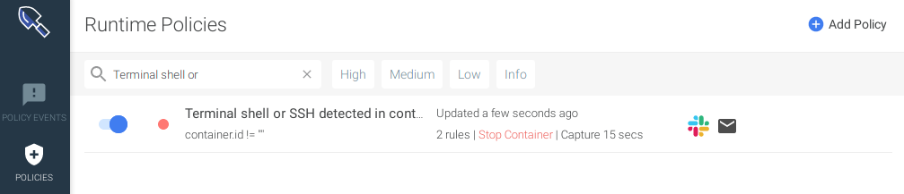

# Terraform Provider for Sysdig

## Introduction

### What is Terraform

[Terraform](https://www.terraform.io/) is a tool for building, changing, and versioning infrastructure safely and efficiently. 
Terraform can manage existing and popular service providers as well as custom in-house solutions.

Configuration files describe to Terraform the components needed to run a single application or 
your entire datacenter. Terraform generates an execution plan describing what it will do to reach the 
desired state, and then executes it to build the described infrastructure or configuration.

As the configuration changes, Terraform is able to determine what changed and create incremental execution 
plans which can be applied.

### Terraform Provider for Sysdig

The Terraform Provider for Sysdig allows you to manage your configuration in Sysdig Secure 
and Sysdig Monitor as code, allowing you to synchronize your declarative configuration with
the configuration at the Platform.

This enables you several cases like:
- Backup/restore
- Disaster recovery
- Configuration version management

## Installation

To use the provider, first you need to install Terraform, which is the main executable that
interacts with the provider.

Download the Terraform executable for your OS/Architecture from 
here: [https://www.terraform.io/downloads.html](https://www.terraform.io/downloads.html)

When you have it installed, download the 
[latest version of the Terraform Provider for Sysdig](https://github.com/sysdiglabs/terraform-provider-sysdig/releases/latest)
for your OS/Architecture, extract it and move the executable under `$HOME/.terraform.d/plugins` (you need to create
this directory if it does not exist yet) as this link suggests: 
[https://www.terraform.io/docs/configuration/providers.html#third-party-plugins](https://www.terraform.io/docs/configuration/providers.html#third-party-plugins) .

## Use example

Terraform will use the Sysdig provider when you specify a [resource](https://www.terraform.io/docs/configuration/resources.html)
or [data source](https://www.terraform.io/docs/configuration/data-sources.html) with a name starting with `sysdig_*` (i.e.: `sysdig_user`)

But in order to actually create valid requests to the API and create/update/remove those resources,
you need to specify a correct API token for the product.

You can do so in 2 ways:
1. Using environment variables
2. Using a tfvars file.

### Configure the provider: Using env vars

You can configure the following environment variables to specify the API token:
- `SYSDIG_SECURE_API_TOKEN`
- `SYSDIG_MONITOR_API_TOKEN`

For example:

```sh
$ export SYSDIG_SECURE_API_TOKEN=323232323-3232-3232-32323232
$ export SYSDIG_MONITOR_API_TOKEN=343434343-3434-3434-34343434
```

Once you execute Terraform and apply the manifests, that env vars will be used to configure
the provider and create API calls.

### Configure the provider: Using a tfvars file

To use a [tfvars file](https://www.terraform.io/docs/configuration/variables.html#variable-definitions-tfvars-files)
you need to first create it, and specify the API tokens as [variables](https://www.terraform.io/docs/configuration/variables.html), for example:

```
# File: terraform.tfvars

secure_token = "323232323-3232-3232-32323232"
monitor_token = "343434343-3434-3434-34343434"
```

Then, you can reference it in the [provider configuration block](https://www.terraform.io/docs/configuration/providers.html#provider-configuration):

```hcl
provider "sysdig" {
  sysdig_monitor_api_token = var.monitor_token
  sysdig_secure_api_token  = var.secure_token
}
```

### Creating resources with Terraform

This is an example to create a pair of rules able to detect SSH connections and 
shells spawned in containers.
                
Start by defining a couple of rules in the `rules.tf` file. One rule will detect inbound and outbound connections 
made to the port 22, and the other will detect a shell process being spawned.

For more information about the configuration blocks, see: [https://www.terraform.io/docs/configuration/syntax.html](https://www.terraform.io/docs/configuration/syntax.html)

```hcl
resource "sysdig_secure_rule_network" "disallowed_ssh_connection" {
  name           = "Disallowed SSH Connection detected"
  description    = "Detect any new ssh connection to a host"
  tags           = ["network"]

  block_inbound  = true
  block_outbound = true

  tcp {
    matching     = true
    ports        = [22]
  }
}

resource "sysdig_secure_rule_process" "terminal_shell" {
  name        = "Terminal shell detected"
  description = "A shell was used as the entrypoint/exec point"
  tags        = ["shell"]

  processes   = ["ash", "bash", "csh", "ksh", "sh", "tcsh", "zsh", "dash"]
}
``` 

Now create a policy in a file called `policy.tf` to define how these rules 
are applied. The policy will stop the affected container and trigger a capture for 
further troubleshooting. 

```hcl
resource "sysdig_secure_policy" "terminal_shell_or_ssh_in_container" {
  name        = "Terminal shell or SSH detected in container"
  description = "Detects a terminal shell or a ssh spawned in a container"
  enabled     = true
  severity    = 0 // HIGH
  scope       = "container.id != \"\""
  rule_names  = [sysdig_secure_rule_network.disallowed_ssh_connection.name,
                 sysdig_secure_rule_process.terminal_shell.name]

  actions {
    container               = "stop"
    capture {
      seconds_before_event  = 5
      seconds_after_event   = 10
    }
  }
}
```

With the given `scope`, the policy will only be applied to processes being executed inside containers:

```
scope = "container.id != \"\""
``` 

Using `terraform apply` the resources are applied in the backend: 



 Terraform tells us that is going to create 3 resources, which matches what we defined in `rules.tf` and `policy.tf`. 



 After applying the plan, Terraform reports that the 3 resources have been successfully created. The policy uses the 
 rules created before, that’s why it’s the last one being created.

The resources have been created, this is how they look in Sysdig Secure: 





 But now the problem is that, if this policy triggers there's no alert notice unless notification channels are defined. 
Creating two notification channels, one for the email and another one for slack in a file called `notification.tf`,
will alert us when the policy is triggered:

```hcl
resource "sysdig_secure_notification_channel" "devops-email" {
  name                 = "DevOps e-mail"
  enabled              = true
  type                 = "EMAIL"
  recipients           = "devops@example.com"
  notify_when_ok       = false
  notify_when_resolved = false
}

resource "sysdig_secure_notification_channel" "devops-slack" {
  name                 = "DevOps Slack"
  enabled              = true
  type                 = "SLACK"
  url                  = "https://hooks.slack.com/services/32klj54h2/34hjkhhsd/wjkkrjwlqpfdirej4jrlwkjx"
  channel              = "#devops"
  notify_when_ok       = false
  notify_when_resolved = false
}
```

Bind them to the policy, modifying the file `policy.tf`; note the `notification_channels` property:

```hcl
resource "sysdig_secure_policy" "terminal_shell_or_ssh_in_container" {
  name        = "Terminal shell or SSH detected in container"
  description = "Detects a terminal shell or a ssh spawned in a container"
  enabled     = true
  severity    = 0 // HIGH
  scope       = "container.id != \"\""
  rule_names  = [sysdig_secure_rule_network.disallowed_ssh_connection.name,
                 sysdig_secure_rule_process.terminal_shell.name]

  actions {
    container               = "stop"
    capture {
      seconds_before_event  = 5
      seconds_after_event   = 10
    }
  }

  notification_channels = [sysdig_secure_notification_channel.devops-email.id,
                           sysdig_secure_notification_channel.devops-slack.id]
}
``` 

Finally, doing a `terraform apply`, it will inform that it will create 2 new resources and modify the existing policy:



 After inputting **yes**, Terraform will create the notification channels and bind them to the policy, 
 ensuring that the state in Monitor and Secure matches our state defined in the code.

This is how the resources appear on the Sysdig Secure UI: 





Now, if someone tries to update it manually, by re-applying the policies, Terraform will
restore the desired status from the `.tf` manifests.

## Full Terraform resources documentation

Check all the available resources and datasources for the Terraform Provider for Sysdig here: 

[Terraform provider for Sysdig Datasources](./usage.md)

---

